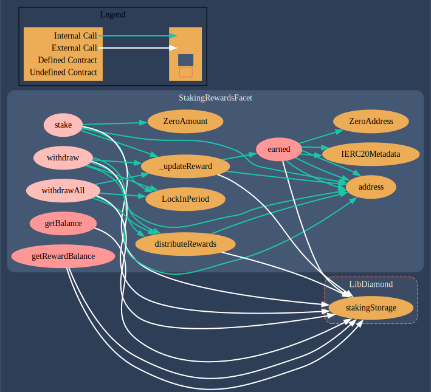

# Staking Rewards

## Overview

Staking is a way of earning rewards for holding a certain cryptocurrency. The Staking Rewards contract does exactly that. It allows users to stake a particular token for a period of time to earn a constant Anual Percentage Return (ARP) of the reward token.

## Assumptions

- Users can stake the staking token at any time.
- There is no limit set for the minimum number of tokens being staked.
- Once staked users cannot withdraw or stake again for the set lock-in period.
- The rewards are generated at a constant 12% APR.
- Rewards are generated as long as there is a stake balance left in the contract.

## Specifications

The staking rewards contract follows the [EIP-2535 Diamond Standard](https://eips.ethereum.org/EIPS/eip-2535). A diamond is a contract with external functions that are supplied by contracts called facets. Facets are separate, independent contracts that can share internal functions, libraries, and state variables.

## Staking Rewards Facet

The Staking Rewards contract is deployed as a Diamond facet, with storage and internal functions abstracted in the LibDiamond library. The staking rewards facet consists of the following external/ public functions,

- `function stake(uint amount) external nonReentrant whenNotPaused;`
- `function withdraw(uint amount) external nonReentrant whenNotPaused;`
- `function withdrawAll() external nonReentrant whenNotPaused;`
- `function earned(address account) public view returns (uint);`
- `function getBalance(address account) public view returns (uint256)`
- `function getRewardBalance(address account) public view returns (uint256)`




## Installation

Install the necessary dependencies mentioned in [package.json](./package.json)

```console
npm install
```

## Usage

### Clean

Delete the smart contract artifacts, the coverage reports and the Hardhat cache

```console
npx hardhat clean
```

### Compile

Compile the contracts and generate typechain types

```console
npx hardhat compile
```

### Test

Run testcases for the smart contracts

```console
npx hardhat test
```

### Contract Size

Generate smart contract size

```console
npx hardhat size-contracts
```

### Coverage

Generate coverage reports for the smart contract

```console
npx hardhat coverage
```

### Deploy

-   Environment variables: Create a `.env` file with values as in [.env.example](./.env.example)

#### localhost

Run hardhat node in one terminal and run the deploy script in another terminal.

```console
npx hardhat node
```

```console
npx hardhat run scripts/deploy.ts --network <network>
```

#### Goerli Testnet

-   Install [Truffle](https://trufflesuite.com/docs/truffle/how-to/use-the-truffle-dashboard/) `npm install -g truffle`
-   Run `truffle dashboard` on one terminal
-   Truffle dashboard will open up on `http://localhost:24012/rpc`
-   Connect wallet and switch to Goerli test network
-   Run the deploy script in another terminal

```console
npx hardhat run scripts/deploy.ts --network truffle
```

### Verify and Publish

Passing constructor params as command line arguments if any exists

```console
npx hardhat verify --network <network_name> <deployed_contract_address> <constructor params>
```

OR

Passing a file with constructor params to --constructor args flag

```console
npx hardhat verify --network <network_name> <deployed_contract_address> --constructor-args verify/contract.args.ts
```

For multiple arguments, follow this [guide](https://hardhat.org/plugins/nomiclabs-hardhat-etherscan.html#multiple-api-keys-and-alternative-block-explorers).

## A typical top-level directory layout

```shell
.
├── build                 # deployed addresses and the ABI of the smart contract (scripts/deploy.ts)
  └── artifacts           # hardhat deployment information [hardhat default]
  └── cache               # hardhat deployment information [hardhat default]
  └── localhost           # address and ABI of the smart contract [localhost (hardhat node)]
  └── goerli              # address and ABI of the smart contract [Goerli testnet]
├── contracts             # smart contracts solidity files
  └── diamond             # diamond standard implemetation of smart contracts.
├── coverage              # coverage report (index.html) [gitignored]
├── node_modules          # npm/yarn dependency files [gitignored]
├── scripts               # deployment scripts (deploy.ts) and other tasks [modified after hardhat default]
├── test                  # test scripts [modified after hardhat default]
├── typechain-types       # typechain types, generated after compilation [gitignored]
├── .env                  # API keys of block explorers for smart contract verification [should be gitignored]
├── .env.example          # format for structuring the .env file
├── .solhint.json         # solhint configuration
├── .solhintignore        # solhint ignore configuration
├── .yarnrc.yml           # https://yarnpkg.com/getting-started/migration#if-required-enable-the-node-modules-plugin
├── coverage.json         # gitignored
├── hardhat-config.ts     # hardhat configuration [modified after hardhat default]
├── package.json          # project details and dependencies
├── README.md             # project details and instructions
├── tsconfig.json         # typescript configuration [hardhat default]
├── yarn.lock             # yarn dependencies
└── .gitignore
```

## Notes

- All the files and folders that have been [modified after hardhat default], as mentioned in the above directory layout, consists of well-commented codes in the respective places, regarding the modifications.
<!-- 
## Reports

Checkout [Reports.md](./Reports.md)
 -->
